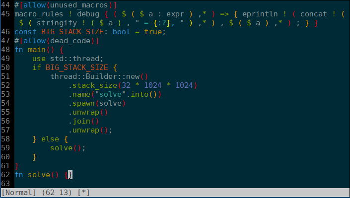

# Junya Sugita

- Live: Kanagawa, Japan
- Birth: 1991/10/29
- Email: hato2000@gmail.com
- GitHub: [https://github.com/hatoo](https://github.com/hatoo)
- Qiita(Japanese Articles): [https://qiita.com/hatoo@github](https://qiita.com/hatoo@github)

## Education

- 2010.4 - 2016.3: B.E The University of Electro-Communications
  - Information Science and Technology
  - Research
    - Applying Deep Learning on medical images

## Skills

### Language

- Japanese
  - Native level
- English
  - Conversational Level
  - TOEIC score: 740

### Programming Languages

- Rust
  - My favorite
  - Usage:
    - Competitive Programming
    - tools
    - Develop text editor
- Python
  - Usage:
    - Machine Learning
- PHP
  - Usage:
    - [Drupal](https://www.drupal.org/)
- C++

### Knowledge about Machine learning

My research was applying Deep Learning on medical images.
I have completed Machine Learning course in [coursera](https://www.coursera.org/learn/machine-learning).
I have good knowledge about basic Machine learning mechanics.
I developed some Machine learning applications, you can see in Projects section.

#### Competitive Programming Ratings

- AtCoder
  - Max Rating: 1790
  - Blue coder
  - [https://beta.atcoder.jp/users/hatoo](https://beta.atcoder.jp/users/hatoo)
  - Solved the most number of problems with Rust in AtCoder
    - [https://kenkoooo.com/atcoder/?user=hatoo&kind=user](https://kenkoooo.com/atcoder/?user=hatoo&kind=user)
- Codeforces
  - Max Rating: 1872
  - Blue coder
  - [http://codeforces.com/profile/hatoo](http://codeforces.com/profile/hatoo)

## Projects

- [Accepted](https://github.com/hatoo/Accepted)
  - A modal text editor for competitive rust programmer written with Rust.
  - Primary target is in competitive Rust programmers.
  - Autoformat with Rustfmt
  - Completion with RLS / Racer
  - Mouse support
  - I participate every programming contests with this editor.
    
- [cargo-snippet](https://github.com/hatoo/cargo-snippet)
  - Snippet manager for competitive rust programmer.
  - Manege code snippet with test and benchmark.
- [competitive-rust-snippets](https://github.com/hatoo/competitive-rust-snippets)
  - Algorithm snippets for competitive programming in Rust
  - Managed by cargo-snippet
- [chainer-text-generator](https://github.com/hatoo/chainer-text-generator)
  - Learn and generate text by Differentiable Neural Computers.
- RNN-hearthstone-card-generator-web
  - http://hatoo.github.io/RNN-hearthstone-card-generator-web/
  - Generate a Hearthstone card text by LSTM.
- Blue Bomber
  - https://www.youtube.com/watch?v=elRqX9dSnaI
  - A game for Unreal Engine 4 petit contest 1 by [historia](http://historia.co.jp/)
  - Got Kayumi(家弓) award.
    - http://historia.co.jp/archives/649/
  - Built with Unreal Engine 4.

## Work History

### Digital Circus

May. 2016 ~ 

Develop and maintain Drupal sites.

## Awards

- Codeforces Marathon Round 2
  - http://codeforces.com/contest/1014/standings
  - 6th place
  - Beam search and heuristic
- Hokkaido Univ.& Hitachi 1st New-concept Computing Contest 2017
  - https://beta.atcoder.jp/contests/hokudai-hitachi2017-1
  - 15th place
- RCO Nihon-bashi half marathon 2 Preliminary
  - https://beta.atcoder.jp/contests/rco-contest-2018-qual
  - 19th place
- Future Meets You Contest(open)
  - https://beta.atcoder.jp/contests/future-meets-you-contest-2018-open
  - 18th place
- Kayumi(家弓) award in Unreal Engine 4 petit contest 1
  - http://historia.co.jp/archives/649/
- - -
- SoundHound Inc. Programming Contest 2018 -Masters Tournament-
  - https://beta.atcoder.jp/contests/soundhound2018-summer-qual
  - 216th place